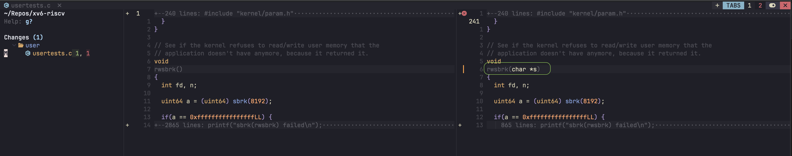

# riscv-toolchain-docker-image
A docker image for the RISC-V C and C++ cross-compiler.
(basically a build image of https://github.com/rukmaldias/riscv-toolchain-docker-image toolchain)

Run interactively
>docker pull rukmaldias/riscv-toolchain:ubuntu24.04
>docker run -it --rm riscv-toolchain:ubuntu24.04

Or mount your project directory
>docker run -it --rm -v $(pwd):/workspace riscv-toolchain:ubuntu24.04

Or run a specific command
>docker run --rm -v $(pwd):/workspace riscv-toolchain:ubuntu24.04 riscv64-unknown-elf-gcc --version

Build the project
>docker run --rm -v $(pwd):/workspace riscv-toolchain:ubuntu24.04 make

Fix this, The function should change from:

Build fs image
>docker run --rm -v $(pwd):/workspace riscv-toolchain:ubuntu24.04 make fs.img 

Run the image/OS 
>qemu-system-riscv64 -machine virt -bios none -kernel kernel/kernel -m 128M -smp 3 -nographic -global virtio-mmio.force-legacy=false -drive file=fs.img,if=none,format=raw,id=x0 -device virtio-blk-device,drive=x0,bus=virtio-mmio-bus.0

